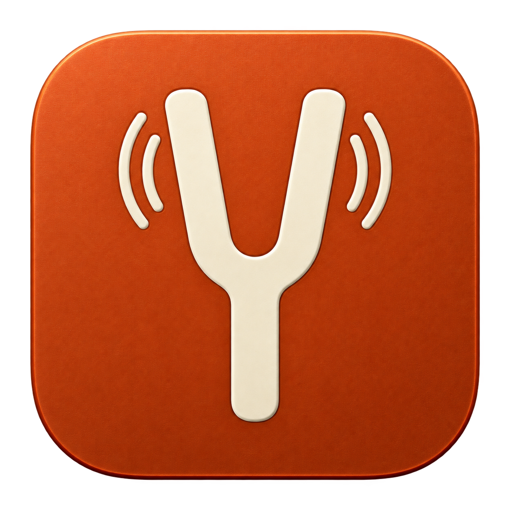
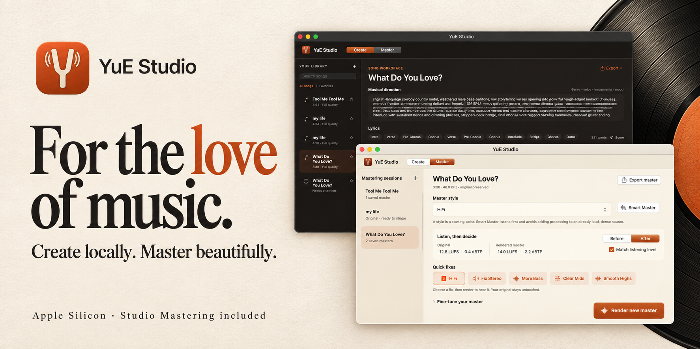
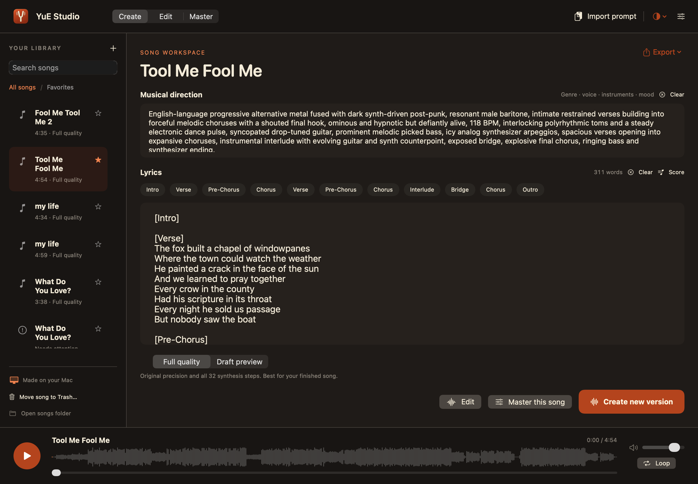
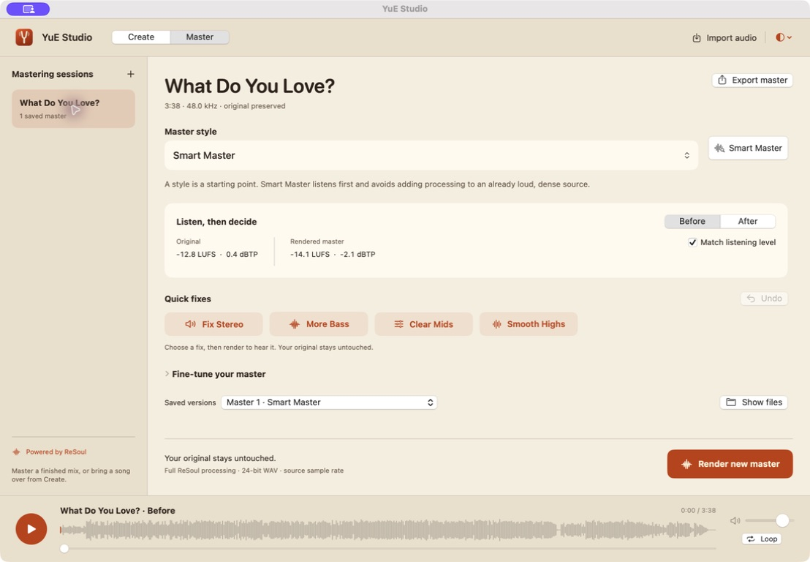
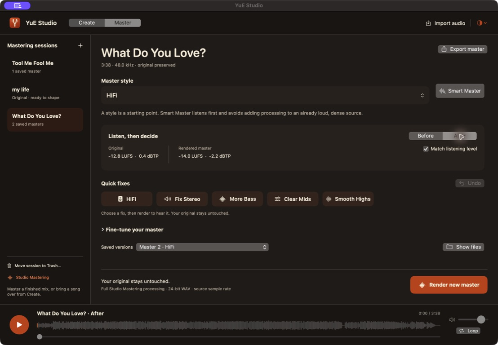
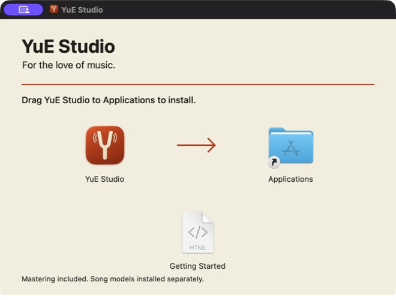

<p align="center"></p>
<h1 align="center">YuE Studio</h1>
<p align="center"><strong>A place for your songs.</strong><br>Local music creation for Apple Silicon. A native studio built around the music.</p>

<p align="center">
<a href="https://github.com/smittyPNW/YuE-Studio/actions/workflows/public-checks.yml"></a>


<a href="LICENSE"></a>
</p>



**Give a song its words and musical direction. YuE2 turns them into a composition and full stereo audio, locally on your Mac.** Keep your lyrics, versions, playback, and exports together in a warm native SwiftUI workspace.

[Download for Mac](https://github.com/smittyPNW/YuE-Studio/releases/download/v0.4.0/YuE-Studio-0.4.0-Apple-Silicon.dmg) · [Setup](docs/SETUP.md) · [Prompting, breaks & solos](docs/PROMPTING.md) · [Releases](https://github.com/smittyPNW/YuE-Studio/releases)

> **Community edition:** generation and the complete Studio Mastering engine are included in source. Shared for the love of music and AI. YuE2 model weights download separately and retain their [noncommercial license](MODEL_LICENSE).

## Make room for the music

- **Write with structure.** Separate musical direction from lyrics; jump between verse, chorus, bridge, and other section markers.
- **Keep the full render.** New songs use 32-step synthesis and full composition planning. The interface does not trade quality for speed.
- **Listen and keep versions.** A persistent player, waveform, favorites, and a song library keep your work close. Existing drafts can be compared with full renders.
- **Recover useful work.** Saved generation artifacts support recovery and full-quality rerendering. Failed jobs remain visible rather than disappearing.
- **Finish optionally.** Send a finished song to Master—or import a separate recording without generating anything.
- **One heavy job at a time.** Generation and mastering share an admission gate and file lock. The generation worker exits before mastering begins.
- **Clear space safely.** Move song projects or mastering sessions to the Mac Trash. Restore them with Finder’s Put Back; exported copies and imported originals stay in place.
- **Keep your originals.** Mastering uses private source copies and separate rendered versions. Export refuses to replace existing audio.

## The actual app

### Create · dark



### Master · light



*Studio Mastering includes Smart Master, 43 starting styles, Before/After listening, and the iOS-inspired **HiFi · Fix Stereo · More Bass · Clear Mids · Smooth Highs** buttons. Fixes update editable settings; they never silently process a song.*

<details><summary>Master · dark</summary>



</details>

The screenshots are direct captures. Campaign images are imagegen artwork based on those captures and are not pixel-perfect UI documentation.

## Install it

Download the **[Apple Silicon DMG](https://github.com/smittyPNW/YuE-Studio/releases/download/v0.4.0/YuE-Studio-0.4.0-Apple-Silicon.dmg)**, drag YuE Studio to Applications, then open the installed app. Requires macOS 14 or later on an M-series Mac. The app and disk image are Developer ID signed, Apple-notarized and stapled.

**Mastering is ready immediately.** Choose Master and import your recording. Song generation uses a separate, one-time [runtime and model setup](docs/SETUP.md#generation-runtime); existing YuE Studio runtimes are reused. Model weights are not inside the DMG. No automatic updater is included.



## Build from source

Apple Silicon Mac, macOS 14+, Xcode command-line tools with Swift, CMake and Ninja (`brew install cmake ninja`), and [uv](https://docs.astral.sh/uv/) for the optional generation runtime. Development and full-song validation used an **M4 Pro Mac mini with 24 GB unified memory**. Other machines and minimum-memory limits have not been validated for this edition.

```bash
git clone https://github.com/smittyPNW/YuE-Studio.git
cd YuE-Studio
bash scripts/setup-runtime.sh
bash custom/package-local.sh
```

The bundle is written to `custom/dist/YuE Studio.app`. Runtime setup downloads Python dependencies and several GB of model weights. An existing YuE runtime is left untouched. Keep this checkout in place because setup installs the Python package in editable mode. Read [the setup guide](docs/SETUP.md) before installing alongside another YuE Studio edition.

Local source builds are ad-hoc signed by default; the published DMG is separately Developer ID signed and notarized. No model weights, generated songs, personal libraries or commercial-app assets are distributed. The build fetches a pinned JUCE revision and compiles the included mastering source. [DMG packaging instructions](docs/DISTRIBUTION.md).

## Mastering, by choice

Studio Mastering works independently: drop in a finished mix, use Smart Master or one of 43 styles, then render and compare. Or bring a generated song over when you want a finishing pass. Generation and mastering never run together.

**HiFi** adds a restrained +1.5 dB bass shelf, gentle low-mid cleanup, +0.6 dB air shelf, and light punch/harmonic detail. It is a starting point, not an automatic improvement for every mix. It preserves custom EQ and unrelated controls, does not stack on repeated clicks, and supports Undo. [Recipe and research](docs/HIFI.md).

Render **24-bit WAV at the source sample rate**. Before/After listening can match loudness without changing the export. Every master is a separate version; your original remains intact.

## Quality and verification

The original custom edition was checked against a complete 218.36-second reference song: full-quality audio and latent bytes matched the preceding generation pipeline. The mastering engine passed a full-song render, source-preservation, export, cancellation, and mutual-exclusion checks. Those are development observations, not speed or quality guarantees for every prompt or Mac.

The public tree has its own independent build and tests. See [verification and boundaries](docs/VERIFICATION.md). No new songs are generated by CI.

## Credits and licenses

This edition builds on **[Tony Weston’s YuE Studio Apple Silicon fork](https://github.com/tonywestonuk/YuE-Studio)**, based on **[YuE2 by M·A·P and collaborators](https://github.com/multimodal-art-projection/YuE)**. Their model, research, inference implementation, and acceleration work make this project possible. Original notices and upstream documentation are preserved. [Full credits and provenance](CREDITS.md).

- Studio and generation source: [Apache-2.0](LICENSE), with [third-party notices](THIRD_PARTY_NOTICES.md).
- Studio Mastering (`mastering/`) and its JUCE-based executable: [AGPL-3.0-only](mastering/LICENSE), with [engine notices](mastering/NOTICE.md). Combined distributions must meet the applicable AGPL terms.
- YuE2 weights: [separate model license](MODEL_LICENSE); they are not covered by the code license.
- Product names/artwork do not grant trademark rights or imply endorsement by upstream researchers.

[Contributing](CONTRIBUTING.md) · [Security](SECURITY.md) · [Changelog](CHANGELOG.md)
